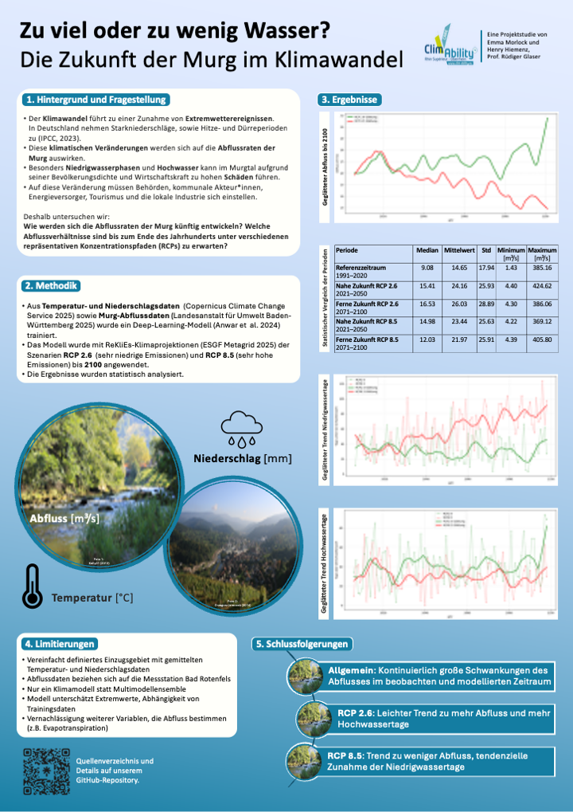

# Projektstudie - Klimawandelanpassung und Kommunikationsformen im Murgtal 
*von Henry Hiemenz und Emma Morlock*

 

### 1.	Hintergrund und Fragestellung
Die Murg ist ein circa 80 km langer Nebenfluss des Rheins im Abschnitt Oberrhein in den baden-württembergischen Landkreisen Freudenstadt und Rastatt (Rothstein et al., 2019). Sie entspringt im Nordschwarzwald und fließt in die Oberrheinische Tiefebene. Durch den menschengemachten Klimawandel werden Extremwetterereignisse weltweit zunehmen (IPCC, 2023). Davon betroffen ist auch die Region und das Einzugsgebiet entlang der Murg mit Städten wie Rastatt und vielen weiteren kleineren Gemeinden. Laut IPCC (2023) wird es in Deutschland bzw. Europa vor allem zur Zunahme von Starkregen kommen. Gleichzeitig wird es auch zu einer starken Zunahme von Hitze und Trockenheit mit einhergehenden Dürreperioden kommen. Diese Annahmen decken sich mit der Klimawirkungs- und Risikoanalyse des Umweltbundesamtes, nach der es zu Zunahmen von Durchschnittstemperatur, Trockenheit und Starkregen in allen Regionen Deutschlands bis zur Mitte des Jahrhunderts kommen wird (UBA, 2022). Es ist davon auszugehen, dass sich diese Entwicklungen hydrologisch auf die Abflussraten der Murg auswirken werden.

Zu viel Niederschlag birgt die Gefahr von Hochwasser und Überschwemmungen entlang der Murg. Die Schäden wären aus sozioökonomischer Perspektive durch die dichte Besiedlung mit Orten wie Gaggenau, Gernsbach und Rastatt sowie durch die Wirtschaftsstärke der Region mit Unternehmen wie Mercedes-Benz, Siemens und zahlreichen mittelständischen Betrieben sehr hoch. Auch mögliche Trocken- oder Niedrigwasserphasen der Murg würden sich negativ auf die gesamte Region auswirken. Davon betroffen wären nicht nur der lokale Tourismus, sondern auch das Wasserinfrastrukturmanagement der Region. Die mit Pumpspeicherkraftwerken ausgestattete Murgtalsperre stellt eine wichtige Elektrizitätsquelle dar. Aus ihr wird zusätzlich Wasser in die darüberliegende Schwarzenbachtalsperre gepumpt. Der Landkreis Rastatt, die kommunalen Behörden, Energieversorger aber auch die lokale Industrie müssen sich somit auf zukünftige Entwicklungen vorbereiten. Aus diesem Grund gehen wir folgender Frage nach: 

*Wie werden sich die Abflussraten  der Murg bis Ende des Jahrhunderts unter verschiedenen repräsentativen Konzentrationspfaden (RCPs) entwickeln?* 

Die Ergebnisse dieser Arbeit können für Planung, Management und Politikgestaltung (z.B. Landkreis Raststatt und Kommunen im Murgtal) eingesetzt werden. Ziel der Untersuchung ist es, den zukünftigen Abfluss der Murg unter verschiedenen Klimaszenarien mittels Deep Learning zu prognostizieren.

### 2.	Daten und Methode
Zur Umsetzung unseres Forschungsvorhabens greifen wir auf Temperatur- und Niederschlagsdaten aus dem ERA5-Projekt zurück (Copernicus Climate Change Service, 2025). Daten zum historischen Abfluss werden über die Landesanstalt für Umwelt Baden-Württemberg (LUBW) an der Messstation Bad Rotenfels bezogen (LUBW, 2025). Mit den Inputdaten Temperatur und Niederschlag sowie dem Output Abfluss werden wir unser erstes Modell trainieren, validieren und testen. Dazu splitten wir die Daten zeitlich geordnet in 60% Training, 20% Validierung und 20% Test. Sobald das beste Modell auf Basis der historischen Daten identifiziert wurde, wird es auf die projizierten ReKliEs-Daten angewendet (Neuer Input) (ESGF MetaGrid 2025). Hier werden die Referenzperioden 2021 bis 2050 als Repräsentation der näheren Zukunft und 2071 bis 2100 als Repräsentation der ferneren Zukunft gebildet. Eine Übersicht zum geplanten Ablauf findet sich in Tabelle 1.

Modellarchitektur: Wir werden ein Time-Lagged Artificial Neural Network einsetzen. Nach Anwar et al. (2024) ist dieses neuronale Netz mit am besten zur Abflussprognose geeignet. Es ist ein mehrschichtiges neuronales Netz, das durch Zeitverzögerungen über mehrere Eingaben hinweg zeitliche Abhängigkeiten von Eingabewerten verarbeiten kann (Peddinti et al., 2015). Diese Eigenschaft spielt bei der Abflussprognose eine zentrale Rolle, da auch in der realen Welt eine Verzögerung zwischen Niederschlag und einem Anstieg des Abflusses besteht. Die zeitliche Auflösung wird täglich gewählt, um sowohl kurzfristige Extremereignisse als auch langfristige saisonale Muster zu erfassen.

Tabelle 1: Überblick über Input und Output

| Szenario | Input | Output |
|----------|----------|----------|
| historische Daten |	Temperatur °C, Niederschlag mm | Abfluss m3/s |
| RCP2.6 | Temperatur °C, Niederschlag mm |	Abfluss m3/s |
| RCP8.5 |	Temperatur °C, Niederschlag mm |	Abfluss m3/s |

### 3. Limitation 
Das Forschungsvorhaben unterliegt mehreren methodischen Limitationen. Die räumliche Auflösung der ERA5 und ReKliEs-Daten  kann kleinräumige hydrologische Prozesse im Einzugsgebiet der Murg nur begrenzt erfassen. Das Einzugsgebiet wurde vereinfacht definiert und Temperatur- und Niederschlagswerte gemittelt. Die Abflussdaten beziehen lediglich auf die Messstation Bad Rotenfels. Deep Learning Modelle haben potenziell Schwierigkeiten bei der Vorhersage seltener Extremereignisse, da diese in den historischen Trainingsdaten unterrepräsentiert sind (Frame et al., 2022). Auch das hier entwickelte Modell unterläuft diesem Bias. Zusätzlich  berücksichtigt unser vereinfachtes Modell nur Temperatur und Niederschlag als Inputvariablen und vernachlässigt komplexere hydrologische Prozesse wie Schneeschmelze, Evapotranspiration, oder anthropogene Einflüsse wie Landnutzungsänderungen, Wasserentnahmen und Speicherbewirtschaftung. Außerdem vereinfacht die Verwendung von lediglich einem Klimamodell vereinfacht unsere Analyse deutlich, und lässt nicht die Robustheit zu, die ein Multimodellensemble bieten würde. 

### 4. Zusammenfassung
Die Kombination aus regionaler Klimamodellierung und Deep Learning bietet einen vielversprechenden Ansatz zu einer Einschätzung zukünftiger hydrologischer Entwicklungen entlang der Murg. Trotz methodischer Limitationen können die Ergebnisse wichtige Impulse für die präventive Anpassung der Wasserwirtschaft im Murgtal an veränderte Klimabedingungen liefern. Die Ergebnisse wurden in Form eines Posters für lokale Entscheidungsträger*innen zusammengefasst. 

### Literaturverzeichnis

Anwar, H., Khan, A. U., Ullah, B., Taha, A. T. B., Najeh, T., Badshah, M. U., Ghanim, A. A. J., & Irfan, M. (2024). Intercomparison of deep learning models in predicting streamflow patterns: Insight from CMIP6. Scientific Reports, 14(1), 17468. https://doi.org/10.1038/s41598-024-63989-7

Copernicus Climate Change Service, Climate Data Store. (2024). ERA5 post-processed daily statistics on single levels from 1940 to present. Copernicus Climate Change Service (C3S) Climate Data Store (CDS). Abgerufen am 09.11.2025, von https://cds.climate.copernicus.eu/datasets/derived-era5-single-levels-daily-statistics?tab=overview

ESGF MetaGrid. (2025). Cordex ReKliEs Output. Abgerufen 30. Oktober 2025, von https://esgf-metagrid.cloud.dkrz.de/search/cordex-dkrz/?project=CORDEX&activeFacets=%7B%22project%22%3A%22CORDEX-Reklies%22%2C%22domain%22%3A%22EUR-11%22%2C%22driving_model%22%3A%22MPI-M-MPI-ESM-LR%22%2C%22data_node%22%3A%22esgf1.dkrz.de%22%2C%22ensemble%22%3A%22r1i1p1%22%2C%22rcm_name%22%3A%22STARS3%22%2C%22rcm_version%22%3A%22v1-r3%22%2C%22time_frequency%22%3A%22day%22%2C%22experiment_family%22%3A%22RCP%22%2C%22experiment%22%3A%22rcp26%22%7D

Intergovernmental Panel on Climate Change (IPCC). (2023). Summary for policymakers. In V. Masson-Delmotte, P. Zhai, A. Pirani, S. L. Connors, C. Péan, S. Berger, N. Caud, Y. Chen, L. Goldfarb, M. I. Gomis, M. Huang, K. Leitzell, E. Lonnoy, J. B. R. Matthews, T. K. Maycock, T. Waterfield, O. Yelekçi, R. Yu, & B. Zhou (Hrsg.), Climate change 2021: The physical science basis. Contribution of Working Group I to the Sixth Assessment Report of the Intergovernmental Panel on Climate Change (S. 3–32). Cambridge University Press. https://doi.org/10.1017/9781009157896.001 

Landesanstalt für Umwelt Baden-Württemberg. (2025). Hydrologische Landespegel—Daten- und Kartendienst der LUBW. Abgerufen am 12.09.2025, von https://udo.lubw.baden-wuerttemberg.de/public/processingChain?repositoryItemGlobalId=hydrologische_landespegel&conditionValuesSetHash=533EF0C&selector=hydrologische_landespegel&sourceOrderAsc=false&offset=0&limit=2147483647

OpenAI. (2024). ChatGPT. https://chat.openai.com/

Peddinti, V., Povey, D., & Khudanpur, S. (2015). A time delay neural network architecture for efficient modeling of long temporal contexts. Interspeech 2015, 3214–3218. https://doi.org/10.21437/Interspeech.2015-647

Rothstein, B., Dotterweich, M., & Zeitler, F. (2019). Nutzungskonflikte bei zukünftigen Niedrigwasserständen, Analyse + Ableitung von Handlungsempfehlungen an den Beispielen Murg und Kocher. LUBW Landesanstalt für Umwelt Baden-Württemberg.

Umweltbundesamt (UBA). (2022). Die Risiken des Klimawandels für Deutschland. Dessau-Roßlau.https://www.umweltbundesamt.de/publikationen/die-risiken-des-klimawandels-fuer-deutschland-0
World Meterological Organization (WMO). (2017). WMO Guidelines on the Calculation of Climate Normals. (S.1-15).

### Erklärung zur Nutzung von KI
Wir erklären, dass im Rahmen der vorliegenden Arbeit KI-gestützte Tools zur Unterstützung bei der Code-Entwicklung und Fehlersuche genutzt wurde (OpenAI, 2024). Zum Beispiel wurde folgender Prompt genutzt: "Erkläre die Fehlermeldung und schlage Lösungsansätze vor.". Die Ergebnisse des Large Language Models wurden kritisch betrachtet und als Rückmeldung und Orientierung zur Bearbeitung der Arbeit genutzt. Die Inhalte, Argumentationen und Interpretationen wurden eigenständig erarbeitet. Soweit wir auf fremde Materialien, Texte oder Gedankengänge zurückgegriffen habe, enthalten unsere Ausführungen Verweise auf die Urheber\*innen und Quellen. Hiermit erkläre wir, dass wir die
vorliegende Arbeit selbstständig erstellt und keine anderen als die angegebenen Hilfsmittel benutzt haben
.

